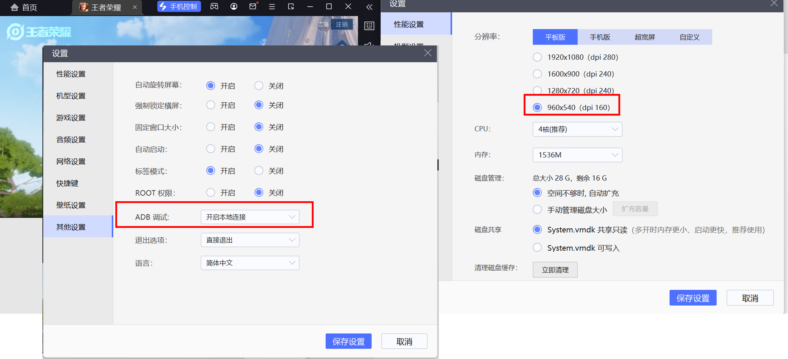

# 运行方法
## 准备工作
* [下载最最新代码](https://github.com/cndaqiang/WZRY/releases)
* 如果最近WZRY有特殊活动，图标有变化，可以看看我是否提供了[资源更新包](https://github.com/cndaqiang/WZRY/issues/8)。<br>或者自己使用AirTestIDE修改对应的图片。
* 安装/升级依赖
```
python -m pip install -r requirements.txt -i https://pypi.tuna.tsinghua.edu.cn/simple  --upgrade
```
* **注**: ARM设备以及Mac上airtest提供的adb可能没有可执行权限，需要修改
```
#具体路劲根据你的环境修改
#Linux(ARM)
cd ~/.local/lib/python3.10/site-packages/airtest/core/android/static/adb/linux
mv adb adb.bak
ln -s /usr/bin/adb .
#Mac
chmod +x ~/anaconda3/lib/python3.11/site-packages/airtest/core/android/static/adb/mac/adb
```
* 开启模拟器/手机的ADB调试。
* * 建议采用`960x540`的分辨率，这样可以解压我的字典[example/字典.分路.android.var_dict_N.zip](example/字典.分路.android.var_dict_N.zip)进行加速以及[自动调整分路并选择熟练度最低的英雄](https://github.com/cndaqiang/WZRY/issues/13#issuecomment-2205392546)。你自己去生成字典也是可以的。



## 运行方式
### 终端运行
```
python -u wzry.py 配置文件
```
其中配置文件可以省略，默认单进程控制`127.0.0.1:5555`的安卓设备。
配置文件支持的控制参数见[airtest-mobileauto](https://pypi.org/project/airtest-mobileauto/)，下面是一些配置文件示例

* 控制usb连接的安卓手机
```
[client]
LINK_dict = {
    0: "Android:///4e86ac13"}
```

* 控制无线连接的安卓手机
```
[client]
LINK_dict = {
    0: "Android:///192.168.192.10:5555"}
```

* 控制两个安卓设备组队
```
[client]
totalnode = 2
multiprocessing = True
LINK_dict = {
    0: "Android:///192.168.192.10:5555",
    1: "Android:///4e86ac13"}
```

* 控制BlueStacks模拟器多开组队
```
[client]
totalnode = 2
# 不设置BlueStackdir，脚本也可以正常运行。设置后支持模拟器的操作，7*24h运行时更省电
BlueStackdir = C:\Program Files\BlueStacks_nxt
multiprocessing = True
LINK_dict = {
    0: "Android:///127.0.0.1:5555",
    1: "Android:///127.0.0.1:5565"}
```

* 控制LDPlayer模拟器多开组队
```
[client]
# 节点配置
totalnode = 2
# 不设置LDPlayerdir，脚本也可以正常运行。设置后支持模拟器的操作，7*24h运行时更省电
LDPlayerdir = D:\GreenSoft\LDPlayer
multiprocessing = True
LINK_dict = {
    0: "Android:///127.0.0.1:5555",
    1: "Android:///127.0.0.1:5557"}
```

* Linux控制docker容器多开组队
```
# 节点配置
totalnode = 3
# 不设置dockercontain，脚本也可以正常运行。设置后支持容器的操作，7*24h运行时更省电
dockercontain = {
    0: "androidcontain0.high",
    1: "androidcontain1"}
    2: "androidcontain2"}
multiprocessing = True
LINK_dict = {
    0: "Android:///127.0.0.1:15555",
    1: "Android:///127.0.0.1:5565",
    2: "Android:///127.0.0.1:5575"
    }
```

### 使用AirTestIDE软件运行
* **不推荐, 我只用AirTestIDE修改脚本的图片资源**
* 下载地址[AirTestIDE](https://airtest.netease.com/), 配置python的路径
* 用AirTest直接打开wzry.py
* 如果要修改配置参数，请阅读wzry.py.
* 点击运行


# 高级功能
* **通过在代码目录创建一些文件来动态调整代码的运行模式，可以实现自动切换分路、选择熟练度最低的英雄，进行王者模拟战等操作**
* 控制文件 `txt` 不参与仓库同步, [文件控制运行示例](https://github.com/cndaqiang/WZRY/issues/13)
- **注：所有文件都默认采用UTF8格式编码**
- 以最新代码为准, 下面的内容仅供参考。

## 注入命令
```
self.重新设置英雄FILE = f"WZRY.{self.mynode}.重新设置英雄.txt"
self.临时初始化FILE = f"WZRY.{self.mynode}.临时初始化.txt"
self.对战前插入FILE = f"WZRY.{self.mynode}.对战前插入.txt"
```

## 控制参数
控制参数可以用上面注入命令的方式，也可以根据这些文件进行识别
```
self.结束游戏FILE = "WZRY.ENDGAME.txt"
self.只战一天FILE = "WZRY.oneday.txt" #对战只循环一天, 可使用系统的自动化任务指定运行的时间
self.SLEEPFILE = "WZRY.SLEEP.txt"
self.触摸对战FILE = "WZRY.TOUCH.txt"  # 在5v5的对战过程中,频繁触摸,提高金币数量
self.标准模式触摸对战FILE = "WZRY.标准模式TOUCH.txt"  # 检测到该文件后该次对战使用5v5标准对战模式
self.青铜段位FILE = f"WZRY.{self.mynode}.青铜段位.txt"  # 检测到该文件后该次对战使用5v5标准对战模式
self.标准模式FILE = f"WZRY.{self.mynode}.标准模式.txt"  # 检测到该文件后该次对战使用5v5标准对战模式
self.临时组队FILE = "WZRY.组队.txt"
```


## 更新资源
```
self.图片更新FILE = "WZRY.图片更新.txt"
```

## 程序内部控制
```
self.重新登录FILE = f"WZRY.{self.mynode}.重新登录FILE.txt"
self.无法进行组队FILE = f"WZRY.无法进行组队FILE.txt"
self.免费商城礼包FILE = f"WZRY.{self.mynode}.免费商城礼包.txt"  # 检测到该文件后领每日商城礼包
self.KPL每日观赛FILE = f"WZRY.KPL每日观赛FILE.txt"
```